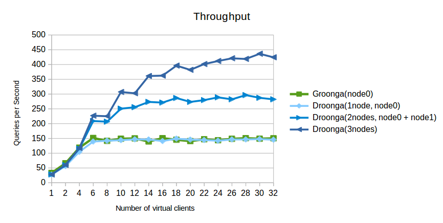

# trbmeetup

subtitle
:   Fast fulltext search in Ruby, without Java
    -Groonga, Rroonga and Droonga-

author
:   YUKI Hiroshi

institution
:   ClearCode Inc.

allotted_time
:   30m

theme
:   groonga

# Abstract

 * Fulltext search?
 * Groonga and Rroonga
   - easy fulltext search in Ruby
 * Droonga
   - scalable fulltext search

# Introduction

What's *fulltext search*?

# Searching without index

ex. `Array#grep`
ex. `LIKE` operator in SQL

~~~
SELECT name,location
  FROM Store
 WHERE name LIKE '%Tokyo%';
~~~

 * easy, simple, but *slow*

# Fulltext search with index

{:relative_width="60" align="right"}

 * Fast!!

# Demonstration

Methods
: * `Array#grep` (not indexed)
  * `GrnMini::Array#select` (indexed)

Data
: * Wikipedia(ja) pages

# Demonstration: Result

{:relative_height="90"}

# Why fast?

{:relative_width="80"}

# Why fast?

{:relative_width="80"}

# Why fast?

{:relative_width="80"}

# Why fast?

{:relative_width="80"}

# Why fast?

{:relative_width="80"}

# Why fast?

{:relative_width="80"}

# How introduce?

Major ways

 * Sunspot
 * elasticsearch-ruby

# Sunspot?

A binding of *Solr* for
Ruby and Rails (ActiveRecord)

~~~
class Post < ActiveRecord::Base
  searchable do
    ...
  end
end

result = Post.search do
  fulltext 'best pizza'
  ...
end
~~~

# elasticsearch-ruby?

A client library of *Elasticsearch* for Ruby

~~~
client = Elasticsearch::Client.new(log: true)
client.transport.reload_connections!
client.cluster.health
client.search(q: "test")
~~~

# Relations of services

{:relative_width="80"}

# But...

 * [Apache Solr](http://lucene.apache.org/solr/): "built on Apache Lucene™."
 * [Elasticsearch](http://www.elasticsearch.org/overview/elasticsearch/): "Build on top of Apache Lucene™"
 * [Apache Lucene](http://lucene.apache.org/): "written entirely *in Java*."

# Java!!

{:relative_width="80"}

# In short

 * They require *Java*.
 * My Ruby product have to be combined with *Java*, just for fulltext search.

# Alternative choice

*Groonga*
and
*Rroonga*

# Groonga

 * Fast fulltext search engine written in *C++*
 * Realtime indexing
 * Read/write lock-free
 * Originally designed to search increasing huge numbers of comments (like Twitter)

# Groonga

Different usecases

Groonga
: * Command line tool
  * HTTP server

libgroonga
: * In-process library

# *R*roonga

 * Based on libgroonga
 * Low-level binding of Groonga for *Ruby*
 * Works like as "better SQLite"
   for your application

# Groonga and Rroonga

{:relative_height="90"}

# Relations of services

{:relative_width="80"}

# Usage of Rroonga

~~~
% sudo gem install rroonga
~~~

Groonga (libgroonga) is also installed as a part of the package.

# Usage of Rroonga

Schema definition

~~~
require "groonga"

Groonga::Database.create(path: "/tmp/bookmark.db")
Groonga::Schema.create_table("Items",
                             type:     :hash,
                             key_type: "ShortText") do |table|
  table.text("title")
end
Groonga::Schema.create_table("Terms",
                             type:              :patricia_trie,
                             normalizer:        :NormalizerAuto,
                             default_tokenizer: "TokenBigram") do |table|
 table.index("Items.title")
end
~~~

# Usage of Rroonga

Data loading

~~~
require "groonga"

Groonga::Database.open("/tmp/bookmark.db")

items = Groonga["Items"]
items.add("http://en.wikipedia.org/wiki/Ruby",
          title: "Wikipedia")
items.add("http://www.ruby-lang.org/",
          title: "Ruby")
~~~

# Usage of Rroonga

Fulltext search

~~~
require "groonga"

Groonga::Database.open("/tmp/bookmark.db")

items = Groonga["Items"]
ruby_items = items.select do |record|
  record.title =~ "Ruby"
end
~~~

# FYI: GrnMini

 * Lightweight wrapper for Rroonga
 * Limited features, easy to use
 * Good first step to try fulltext search on your Ruby product

# FYI: GrnMini

~~~
require "grn_mini"

GrnMini::create_or_open("/tmp/bookmarks.db")

items = GrnMini::Array.new("Items")
items << { url:   "http://en.wikipedia.org/wiki/Ruby",
           title: "Wikipedia" }
items << { url:   "http://www.ruby-lang.org/",
           title: "Ruby" }

ruby_items = items.select("title:Ruby")
~~~

# *D*roonga

Groonga
: works with single process on a computer

*D*roonga
: works with multiple computers constructiong a Droonga cluster

# Droonga

{:relative_width="80"}

# Droonga

 * Scalable
   (replication + partitioning)
 * Groonga compatible
   HTTP interface
 * Client library for Ruby
   (`droonga-client`)

# Droonga

{:relative_height="90"}

# Usage of Droonga

~~~
# base="https://raw.githubusercontent.com/droonga"
# curl ${base}/droonga-engine/master/install.sh | \
    bash
# curl ${base}/droonga-http-server/master/install.sh | \
    bash
# droonga-engine-catalog-generate --hosts=node0,node1,node2
# service droonga-engine start
# service droonga-http-server start
~~~

# Usage of Droonga

~~~
$ endpoint="http://node0:10041"
$ curl "${endpoint}/d/table_create?name=Store&
        flags=TABLE_PAT_KEY&key_type=ShortText"
~~~

# References

Sunspot
: http://sunspot.github.io/

elasticsearch-ruby
: https://github.com/elasticsearch/elasticsearch-ruby

# References

Apache Lucene
: http://lucene.apache.org/

Apache Solr
: http://lucene.apache.org/solr/

Elasticsearch
: http://www.elasticsearch.org/overview/elasticsearch/

# References

Groonga
: http://groonga.org/

Rroonga
: http://ranguba.org/

Droonga
: http://droonga.org/

# References

GrnMini
: https://github.com/ongaeshi/grn_mini

Comparison of PostgreSQL, pg_bigm and PGroonga
: http://blog.createfield.com/entry/2015/02/03/094940

