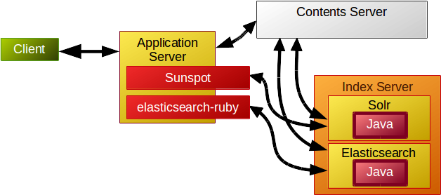
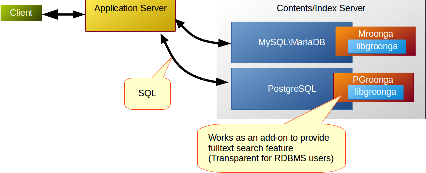

# trbmeetup

subtitle
:   Fast fulltext search in Ruby, without Java
    -Groonga, Rroonga and Droonga-

author
:   YUKI Hiroshi

institution
:   ClearCode Inc.

allotted_time
:   30m

theme
:   groonga

# Abstract

 * Fulltext search?
 * Groonga and Rroonga
   - easy fulltext search in Ruby
 * Droonga
   - scalable fulltext search

# Introduction

What's
*fulltext search*?

# Searching without index

ex. `Array#grep`
ex. `LIKE` operator in SQL

~~~
SELECT name,location
  FROM Store
 WHERE name LIKE '%Tokyo%';
~~~
{: lang="sql"}

 * easy, simple, but *slow*

# Fulltext search w/ index

{:relative_width="60" align="right"}

 * Fast!!

# Demonstration

Methods
: * `Array#grep` (not indexed)
  * `GrnMini::Array#select` (indexed)

Data
: * Wikipedia(ja) pages

# Demonstration: Result

{:relative_height="90"}

# Off topic: why fast?

{:relative_width="80"}

# Off topic: why fast?

{:relative_width="80"}

# Off topic: why fast?

{:relative_width="80"}

# Off topic: why fast?

{:relative_width="80"}

# Off topic: why fast?

{:relative_width="80"}

# Off topic: why fast?

{:relative_width="80"}

# Off topic: why fast?

{:relative_height="90"}

# Off topic: why fast?

{:relative_height="90"}

# How introduce?

Major ways

 * Sunspot
 * elasticsearch-ruby

# Sunspot?

A client library of
*Solr*
for Ruby and Rails
(ActiveRecord)

# Sunspot: Usage

~~~
class Post < ActiveRecord::Base
  searchable do
    # ...
  end
end

result = Post.search do
  fulltext 'best pizza'
  # ...
end
~~~
{: lang="ruby"}

# elasticsearch-ruby?

A client library of *Elasticsearch* for Ruby

~~~
client = Elasticsearch::Client.new(log: true)
client.transport.reload_connections!
client.cluster.health
client.search(q: "test")
~~~
{: lang="ruby"}

# Relations of services

{:relative_width="80"}

# But...

 * [Apache Solr](http://lucene.apache.org/solr/): "built on Apache Lucene™."
 * [Elasticsearch](http://www.elasticsearch.org/overview/elasticsearch/): "Build on top of Apache Lucene™"
 * [Apache Lucene](http://lucene.apache.org/): "written entirely *in Java*."

# Java!!

{:relative_width="80"}

# In short

 * They require *Java*.
 * My Ruby product have to be combined with *Java*, just for fulltext search.

# Alternative choice

*Groonga*
and
*Rroonga*

# Groonga

 * Fast fulltext search engine written in *C*
 * Originally designed to search increasing huge numbers of comments in "2ch" (like Twitter)

# Groonga

 * Realtime indexing
   * Read/write lock-free
   * Parallel updating and searching, without penalty
   * Returns latest result ASAP
 * No transaction
   * No warranty for data consistency

# Relations of services

{:relative_width="80"}

# Groonga's interfaces

via command line interface

~~~
$ groonga="groonga /path/to/database/db"
$ $groonga table_create --name Entries
    --flags TABLE_PAT_KEY --key_type ShortText
$ $groonga select --table Entries
                  --query "title:@Ruby"
~~~

# Groonga's interfaces

via HTTP

~~~
$ groonga -d --protocol http --port 10041
                            /path/to/database/db

$ endpoint="http://groonga:10041"
$ curl "${endpoint}/d/table_create?name=Entries&
          flags=TABLE_PAT_KEY&key_type=ShortText"
$ curl "${endpoint}/d/select?table=Entries&
                          query=title:@Ruby"
~~~

# Groonga's interfaces

Narrowly-defined "Groonga"
: * CLI or server

libgroonga
: * In-process library
  * Like as "better SQLite"

# Groonga

{:relative_height="90"}

# *R*roonga

{:relative_height="90"}

# *R*roonga

 * Based on libgroonga
 * Low-level binding of Groonga for *Ruby*

# Relations of services

{:relative_width="80"}

# Usage: Install

~~~
% sudo gem install rroonga
~~~

Groonga (libgroonga) is also installed as a part of the package.

# Usage: Prepare

~~~
require "groonga"

Groonga::Database.create(path: "/tmp/bookmark.db")
# Or
Groonga::Database.open("/tmp/bookmark.db")
~~~
{: lang="ruby"}

# Usage: Schema

~~~
Groonga::Schema.define do |schema|
  schema.create_table("Items",
                      type:     :hash,
                      key_type: "ShortText") do |table|
    table.text("title")
  end
  schema.create_table("Terms",
                      type:              :patricia_trie,
                      normalizer:        "NormalizerAuto",
                      default_tokenizer: "TokenBigram") do |table|
   table.index("Items.title")
  end
end
~~~
{: lang="ruby"}

# Usage: Data loading

~~~
items = Groonga["Items"]
items.add("http://en.wikipedia.org/wiki/Ruby",
          title: "Wikipedia")
items.add("http://www.ruby-lang.org/",
          title: "Ruby")
~~~
{: lang="ruby"}

# Usage: Fulltext search

~~~
items = Groonga["Items"]
ruby_items = items.select do |record|
  record.title =~ "Ruby"
end
~~~
{: lang="ruby"}

# FYI: GrnMini

 * Lightweight wrapper
   for Rroonga
 * Limited features,
   but easy to use

# FYI: GrnMini: Code

~~~
require "grn_mini"

GrnMini::create_or_open("/tmp/bookmarks.db")

items = GrnMini::Array.new("Items")
items << { url:   "http://en.wikipedia.org/wiki/Ruby",
           title: "Ruby - Wikipedia" }
items << { url:   "http://www.ruby-lang.org/",
           title: "Ruby Language" }

ruby_items = items.select("title:@Ruby")
~~~
{: lang="ruby"}

Good first step to try fulltext search in your Ruby product.

# For much more load...

Groonga
: works with *single process* on a computer

*D*roonga
: works with *multiple computers* constructiong a Droonga cluster

# Droonga

{:relative_width="80"}

# Droonga

 * Scalable
   (replication + partitioning)
 * Groonga compatible
   HTTP interface
 * Client library for Ruby
   (`droonga-client`)

# Droonga

{:relative_height="90"}

# Usage of Droonga

Setup a Droonga node

~~~
# base="https://raw.githubusercontent.com/droonga"
# curl ${base}/droonga-engine/master/install.sh | \
    bash
# curl ${base}/droonga-http-server/master/install.sh | \
    bash
# droonga-engine-catalog-generate --hosts=node0,node1,node2
# service droonga-engine start
# service droonga-http-server start
~~~

# Usage of Droonga

Fulltext search via HTTP
(compatible to Groonga)

~~~
$ endpoint="http://node0:10041"
$ curl "${endpoint}/d/table_create?name=Store&
        flags=TABLE_PAT_KEY&key_type=ShortText"
~~~

# More chices

 * *M*roonga
   * Add-on for *MySQL/MariaDB*
     (Bundled to MariaDB by default)
 * *PG*roonga
   * Add-on for *PostgreSQL*

# Relations of services

{:relative_width="80"}

# SQL w/ fulltext search

Mroonga

~~~
SELECT name,location
  FROM Store
 WHERE MATCH(name)
     AGAINST('+東京' IN BOOLEAN MODE);
~~~
{: lang="sql"}

# SQL w/ fulltext search

PGroonga

~~~
SELECT name,location
  FROM Store WHERE name %% '東京';

SELECT name,location
  FROM Store WHERE name @@ '東京 OR 大阪';

SELECT name,location
  FROM Store WHERE name LIKE '%東京%';
/* alias to "name @@ '東京'"*/
~~~
{: lang="sql"}

# Conclusion

 * *Rroonga* (and *GrnMini*) introduces fast fulltext search into your Ruby product instantly
 * *Droonga* for increasing load
 * *Mroonga* and *PGroonga*
   for existing RDBMS

# References

Sunspot
: http://sunspot.github.io/

elasticsearch-ruby
: https://github.com/elasticsearch/elasticsearch-ruby

# References

Apache Lucene
: http://lucene.apache.org/

Apache Solr
: http://lucene.apache.org/solr/

Elasticsearch
: http://www.elasticsearch.org/overview/elasticsearch/

# References

Groonga
: http://groonga.org/

Rroonga
: http://ranguba.org/

GrnMini
: https://github.com/ongaeshi/grn_mini

# References

Droonga
: http://droonga.org/

Mroonga
: http://mroonga.org/

PGroonga
: https://github.com/pgroonga/pgroonga

# References

Comparison of PostgreSQL, pg_bigm and PGroonga
: http://blog.createfield.com/entry/2015/02/03/094940

# Advertisement

{:relative_width="40" align="right"}

 * 2015.2.18
   Release
 * ￥1728
   (tax-inclusive)
 * Paper/Kindle
